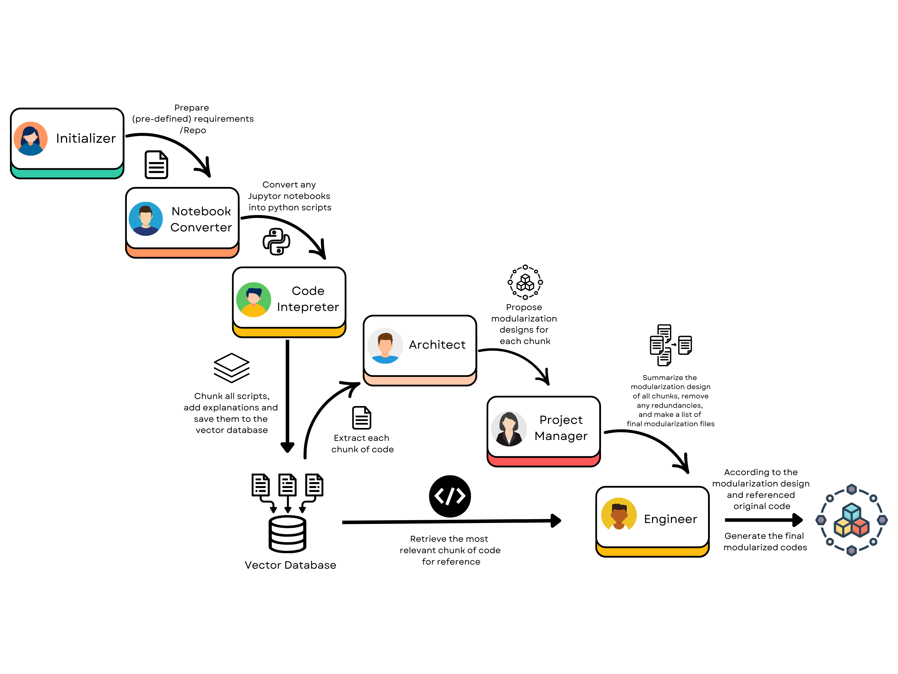
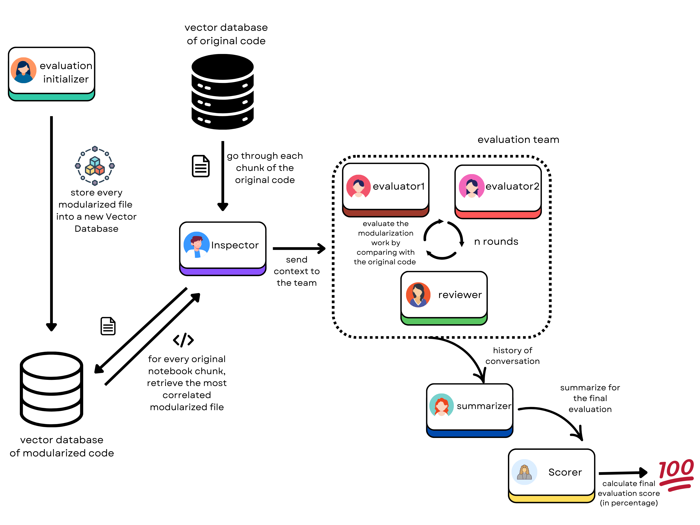

# Multi-agents Workflow details
This project involved in two AI agent teams, one for working on the modularization of the code, and the other for evaluating the quality of the modularized code. The details of the operation workflow would be duscussed in the following sections.

## Modularization Company

As depicted in the figure above, the modularization company is composed of the following roles and their responsibilities(used for system prompt):

- **Initializer**: Initialize the project repository with the pre-defined PRD(Product Requirement Document) and other required directories
- **Notebook_converter**: Extract the python code from the notebook and save it to a .py file in the notebook directory
- **Code_interpreter**: Save the chunks of original code into the RAG database, along with the summarization of the functionality of the code
- **Architect**: Design modular, scalable, and maintainable system architecture that effectively decomposes the original content into independent components, ensuring usability and alignment with the original functionality.
- **Project Manager**: Analyze and integrate the modularized file list derived from orifinal code, consolidating it into a coherent, prioritized set of file tasks.
- **Engineer**: write elegant, readable, extensible, efficient code according to the requirements

To explain the actualy workflow in details:
1. The Initializer establishes the project repository using a predefined Product Requirement Document (PRD) and creates necessary directory structures. The PRD, containing comprehensive project specifications, is thoroughly documented prior to initiating agent workflows.
2. The Notebook Converter transforms Jupyter Notebook files into Python scripts, storing them in a dedicated notebook directory.
3. The Code Interpreter processes the original codebase, segmenting it into manageable chunks that are stored in the RAG database alongside corresponding functional summaries to enhance retrieval efficiency.
4. The Architect develops modularization blueprints for each code segment, generating documentation that outlines key aspects including file purposes, contained functions, and inter-file dependencies.
5. The Project Manager synthesizes and prioritizes the modularized file structure derived from the original codebase, creating a unified task list for implementation.
6. Finally, the Engineer implements the actual code following all specified requirements and architectural guidelines.

## Evaluation Company

- **Evaluation_Initializer**: Initialize the project repository with building up modularized files' RAG engine
- **Inspector**: Extract the Jupytor Notebook chunk respectively and the relative modularized scripts from the RAG to provide as code context for the evaluators
- **Evaluator**: Explicitly evaluate a modularized work produced by AI model
- **Reviewer**: Synthesize diverse viewpoints from the evaluation discusstions and driving fair, well-reasoned conclusions.
- **Summarizer**: Summarize the final evaluation results
- **Scorer**: Calculate the final score based on the evaluation results

To explain the actual workflow in detail:
1. The Evaluation Initializer loads the modularized files into the vector database to enable efficient retrieval and evaluation.
2. The Inspector retrieves original code segments from the original vector database and fetches corresponding modularized scripts from the modularized vector database based on the original code segments.
3. The Inspector assembles a team of three roles: two evaluators to assess the modularized work, and one reviewer to provide iterative feedback during evaluation rounds.
4. Once the Inspector acquires both original and modularized code segments, this context is sent to the evaluation team for thorough assessment. The evaluation process can be configured to run for multiple rounds (n rounds) as needed.
5. After the judgement phase concludes, the Inspector engages the Summarizer to compile evaluation findings and the Scorer to generate a final numerical score quantifying the modularized code's quality and effectiveness.